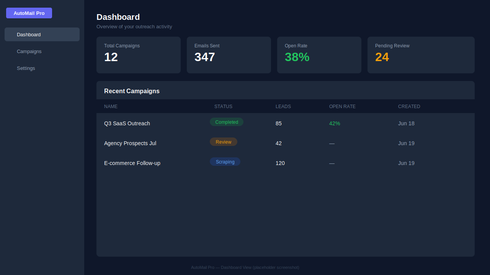
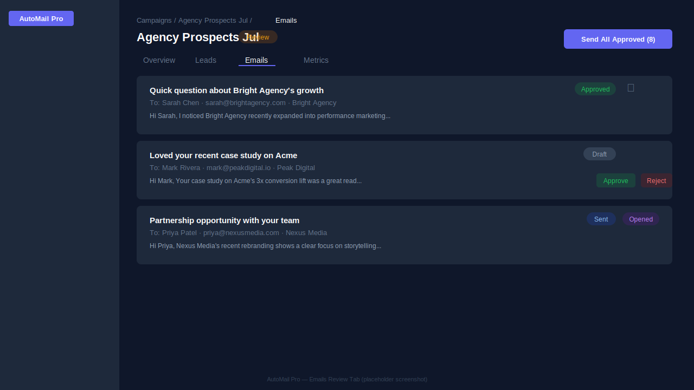
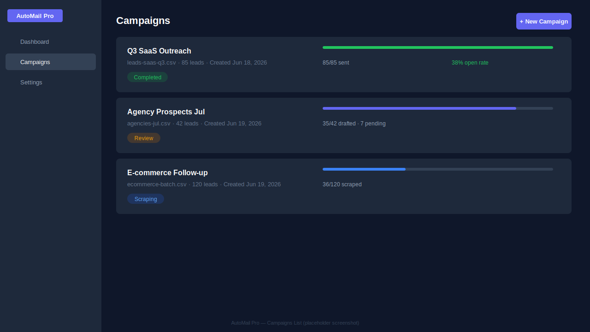
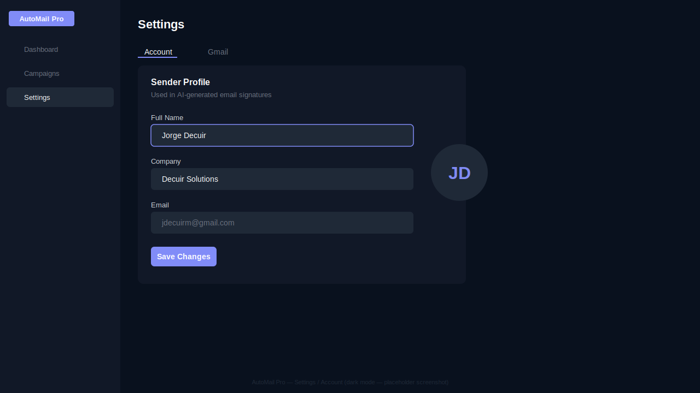
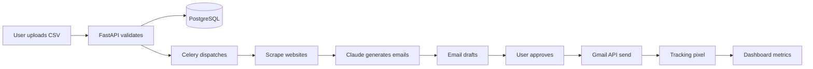

<div align="center">

# AutoMail Pro

**AI-powered B2B lead outreach automation**

[](https://github.com/jdecuirm/automail-pro/actions/workflows/backend-ci.yml)
[](https://github.com/jdecuirm/automail-pro/actions/workflows/frontend-ci.yml)
[](LICENSE)
[](https://github.com/jdecuirm/automail-pro/actions)

[Screenshots](#screenshots) · [Quick Start](#quick-start) · [Architecture](#architecture) · [API Docs](http://localhost:8000/docs)

</div>

---

AutoMail Pro lets B2B sales professionals turn a CSV of leads into personalized cold emails — without copying and pasting for hours. Upload your leads, the system scrapes their public web presence, Claude Haiku writes a tailored draft for each one, you review and approve in a dashboard, and emails go out through your own Gmail account with open tracking baked in.

**Built as a portfolio piece** demonstrating full-stack async Python, AI integration, OAuth 2.0, Celery pipelines, and a production-grade React dashboard.

---

## Screenshots

|                        Dashboard                        |                                Campaign Detail                                 |
| :-----------------------------------------------------: | :----------------------------------------------------------------------------: |
|  |  |

|                      Campaign List                       |                   Dark Mode                    |
| :------------------------------------------------------: | :--------------------------------------------: |
|  |  |

> **Note:** Screenshots are placeholders — run the app locally and capture your own via the [Quick Start](#quick-start) guide.

---

## Features

- **CSV Upload** — Drag-and-drop CSV import with client-side validation (Papa Parse). Accepts `name`, `email`, `company`, `website`, `linkedin_url` columns.
- **Ethical Web Scraping** — Respects `robots.txt`, rate-limits to 1 req/2 s per domain, caches 7 days. Static scraping via httpx + BeautifulSoup4, Playwright fallback for JS-heavy pages.
- **AI Email Generation** — Claude Haiku 4.5 writes personalized B2B cold emails per lead based on scraped research. Subject + plain text + HTML, ready to review.
- **Human-in-the-Loop Review** — Every email must be manually approved before sending. Bulk approve, individual edit, or reject — no auto-fire.
- **Gmail OAuth Sending** — Sends via the user's own Gmail account (OAuth 2.0 delegated). Emails arrive from a real address, not a no-reply domain.
- **HMAC-Signed Tracking Pixels** — Open events logged via a tamper-proof 1×1 PNG endpoint. Deduped per lead+email pair.
- **Real-time Dashboard** — Campaign progress, lead status breakdown, open-rate metrics (Recharts), and a `⌘K` command palette.
- **Sender Profile** — Personalize `[YOUR_NAME]` / `[YOUR_COMPANY]` placeholders in AI drafts from the Settings page.
- **Daily Quota Guard** — Soft cap at 50 emails/day per Gmail account (free tier). Configurable.
- **Dark Mode** — Full dark theme out of the box.

---

## Architecture



### Service boundaries

```
automail-frontend/   Vite + React 19 + TypeScript → Render (static)
automail-backend/    FastAPI + Celery worker       → Railway (two services)
                     PostgreSQL 18                 → Railway addon
                     Redis 7                       → Railway addon
```

The FastAPI app and the Celery worker share the same codebase but run as separate Railway services. The worker pulls tasks from Redis and writes results to PostgreSQL. The API server reads from PostgreSQL and serves the frontend.

---

## Tech Stack

### Backend

| Concern       | Technology                                         |
| ------------- | -------------------------------------------------- |
| Web framework | FastAPI 0.137+ with uvicorn[standard]              |
| Database      | PostgreSQL 18 + SQLAlchemy 2 (async) + Alembic     |
| Task queue    | Celery 5.6 with Redis 7 (broker + result backend)  |
| AI            | Anthropic Claude Haiku 4.5 (`claude-haiku-4-5`)    |
| Scraping      | httpx + BeautifulSoup4 / Playwright (fallback)     |
| Email         | Gmail API via OAuth 2.0 (google-api-python-client) |
| Validation    | Pydantic v2 + pydantic-settings                    |
| Encryption    | cryptography (Fernet) for Gmail refresh tokens     |
| Auth          | JWT (python-jose)                                  |

### Frontend

| Concern       | Technology                     |
| ------------- | ------------------------------ |
| Framework     | React 19 + TypeScript (Vite 8) |
| Styling       | Tailwind CSS v4 + shadcn/ui    |
| Data fetching | TanStack Query v5              |
| Forms         | react-hook-form v7 + zod v4    |
| Charts        | Recharts v3                    |
| CSV parsing   | Papa Parse                     |
| Routing       | React Router v7                |

### Tooling

| Tool             | Purpose                                      |
| ---------------- | -------------------------------------------- |
| `uv`             | Python package manager + virtual environment |
| `ruff`           | Python linter + formatter                    |
| `mypy`           | Python type checker (strict on `app/`)       |
| `vitest` + RTL   | Frontend unit tests                          |
| `detect-secrets` | Pre-commit secret scanning                   |
| GitHub Actions   | CI for both layers                           |

---

## Quick Start

### Prerequisites

- Python 3.13+
- Node.js 20+
- PostgreSQL 18
- Redis 7
- `uv` — install with `curl -LsSf https://astral.sh/uv/install.sh | sh`

### 1. Clone

```bash
git clone https://github.com/jdecuirm/automail-pro.git
cd automail-pro
```

### 2. Backend

```bash
cd automail-backend
cp .env.example .env
# Fill in: DATABASE_URL, FERNET_KEY, ANTHROPIC_API_KEY
# See automail-backend/README.md for FERNET_KEY generation and Gmail OAuth setup

uv sync

# Create the database
psql -c "CREATE USER automail WITH PASSWORD 'yourpassword';"
psql -c "CREATE DATABASE automail OWNER automail;"

# Run migrations
uv run alembic upgrade head

# Start API server
uv run uvicorn app.main:app --reload
# → http://localhost:8000  |  Swagger: http://localhost:8000/docs

# Start Celery worker (new terminal)
uv run celery -A app.celery_app:celery_app worker --loglevel=info
```

### 3. Frontend

```bash
cd automail-frontend
cp .env.example .env   # set VITE_API_URL=http://localhost:8000
npm install
npm run dev
# → http://localhost:5173
```

### 4. Connect Gmail

Navigate to `http://localhost:8000/api/oauth/google/authorize` and complete the OAuth flow.  
Then go to **Settings → Account** in the dashboard to set your sender name and company.

---

## Project Structure

```
automail-pro/
├── .github/workflows/
│   ├── backend-ci.yml       # Python tests + lint on every push/PR
│   └── frontend-ci.yml      # TS check + lint + Vitest on every push/PR
├── assets/screenshots/      # App screenshots (portfolio)
├── automail-backend/
│   ├── app/
│   │   ├── api/             # FastAPI routers (campaigns, emails, leads, oauth, tracking)
│   │   ├── models/          # SQLAlchemy models (campaign, lead, email, tracking_event)
│   │   ├── schemas/         # Pydantic request/response schemas
│   │   ├── services/        # Business logic (scraper, email generator, Gmail sender)
│   │   ├── tasks/           # Celery tasks (scraping, generation, sending)
│   │   ├── config.py        # pydantic-settings (reads from .env)
│   │   ├── database.py      # SQLAlchemy async session factory
│   │   └── main.py          # FastAPI app + router includes
│   ├── alembic/             # Database migrations
│   └── tests/               # pytest test suite (121 tests)
└── automail-frontend/
    └── src/
        ├── api/             # TanStack Query hooks + axios client
        ├── components/      # Shared UI (layout, emails, leads, common)
        ├── hooks/           # Custom React hooks
        ├── routes/          # Page components (Dashboard, Campaigns, Settings)
        └── types/           # TypeScript interfaces matching API schemas
```

---

## Ethical Considerations

AutoMail Pro is built with ethical outreach in mind. These are not configuration options — they are hardcoded constraints:

| Constraint            | Implementation                                                                                        |
| --------------------- | ----------------------------------------------------------------------------------------------------- |
| Respects `robots.txt` | Checked before every domain scrape. `403` → deny. `404` → allow.                                      |
| Rate limited          | Max 1 request per 2 seconds per domain, Redis-backed and worker-safe.                                 |
| Honest User-Agent     | `AutoMailPro/1.0 (+https://github.com/jdecuirm/automail-pro)` — no spoofing.                          |
| No login bypass       | Only publicly accessible pages. LinkedIn `/in/` profiles are skipped (require login → ToS violation). |
| Scrape cache          | 7-day TTL in Redis — avoids hammering the same domain repeatedly.                                     |
| Human approval        | Zero auto-send. Every email requires explicit approval from the user.                                 |
| Daily quota           | Hard cap of 50 emails/day per Gmail account (configurable, free tier default).                        |
| No PII to Claude      | Lead email addresses are never included in the prompt sent to Claude.                                 |
| HMAC-signed pixels    | Tracking URLs are signed — cannot be forged or enumerated.                                            |
| Opt-out footer        | Every sent email includes an unsubscribe link.                                                        |

> **Compliance disclaimer:** AutoMail Pro is a tool for B2B outreach with legitimate interest. Compliance with GDPR, CAN-SPAM, CASL, and other regulations is the user's responsibility.

---

## API Documentation

When the backend is running, interactive API docs are available at:

- **Swagger UI:** `http://localhost:8000/docs`
- **ReDoc:** `http://localhost:8000/redoc`
- **OpenAPI JSON:** `http://localhost:8000/openapi.json`

Key endpoints:

```
POST   /api/campaigns                          Upload CSV → create campaign
GET    /api/campaigns                          List campaigns
GET    /api/campaigns/{id}                     Campaign detail + stats
GET    /api/campaigns/{id}/leads               Paginated leads
GET    /api/campaigns/{id}/emails              Email drafts
POST   /api/campaigns/{id}/send-approved       Bulk send all approved emails

POST   /api/emails/{id}/approve                Approve an email
POST   /api/emails/{id}/reject                 Reject an email
PATCH  /api/emails/{id}                        Edit subject / body

GET    /api/oauth/google/authorize             Start Gmail OAuth flow
GET    /api/oauth/google/status                Check Gmail connection

GET    /api/users/me                           Get sender profile
PATCH  /api/users/me                           Update sender name / company

GET    /api/track/open/{token}                 Tracking pixel (1×1 PNG)
```

---

## Contributing

This is a portfolio project and is not actively accepting external contributions, but issues and feedback are welcome.

If you want to fork and extend it:

1. Fork the repo
2. Create a feature branch: `git checkout -b feat/your-feature`
3. Follow the commit convention: `feat:`, `fix:`, `refactor:`, `test:`, `docs:`
4. Open a PR with a clear description

---

## License

[MIT](LICENSE) © 2026 Jorge Decuir

---

## Built By

**Jorge Decuir** — Full-stack developer (Python + React)

- GitHub: [@jdecuirm](https://github.com/jdecuirm)
- Built with FastAPI, React, and a healthy respect for `robots.txt`
